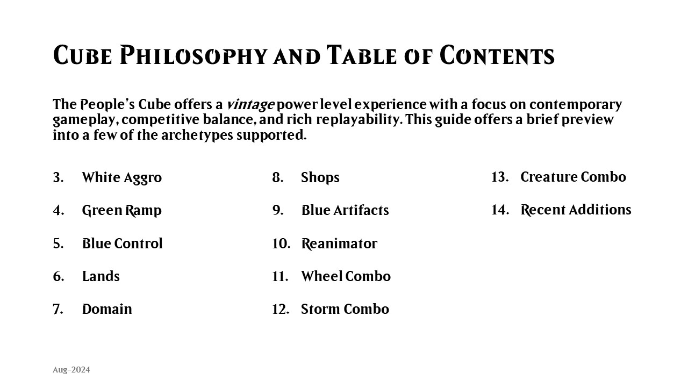

# Cube Draft - Player's Guide
*A printable player's guide for Magic: the Gathering cube draft enthusiasts.* 

## Example Player's Guide
Below is an example Player's Guide for [*The People's Cube*](https://cubecobra.com/cube/overview/barrecan), a powered vintage cube. 

INSERT PRINTED PICTURE

## Getting Started

Included is a Microsoft PowerPoint template (.potx) file. You can easily create your own Player's Guide by adding your card images and text in the templated input fields. Simply import this template into PowerPoint to get started. 

 **1. Create PowerPoint Presentation Using Template**
*If using, remember to import Beleren font*. 

**2. Add Card Images & Text to Templated Fields**

	

 

**3. Export Presentation Slides as Images (.JPG)**

**4. Print & Bind Images at Printshop**

### Where can I get high-resolution card images?
[Scryfall.com](https://scryfall.com/) offers high-resolution images of every Magic card/printing imaginable. 

## Included Slides
The template includes title, table of contents, archetype, and recent additions slides. 

***Cube Philosophy and Table of Contents Slide*:**

***Example Archetype Slide*:**

***Recent Additions Slide*:**

## Included Assets
### Mana Symbols

Included in the *assets* folder are high-resolution .PNG/.SVG files for the 5 Magic colors, as well as a colorless icon. 

### Beleren Font

	

The font used for the PowerPoint template is the beautiful *Beleren* type family. Commisioned in late 2012 by Wizards of the Coast, *Beleren* was designed by Delve Withrington for Magic: the Gathering branding. 

The Beleren type family is comprised of nine fonts in total. Its fantastical nature integrates perfectly with the stunning, highly original art that is a perennial signature of Magic: The Gathering.

I have included the beleren-bold TrueType (.ttf) in the *assets* folder. 

If you enjoy the font, please consider support [the designer](https://delvefonts.com/). 

## Help

Please create a pull request if you make any additions to the template you would like to share. :blush: